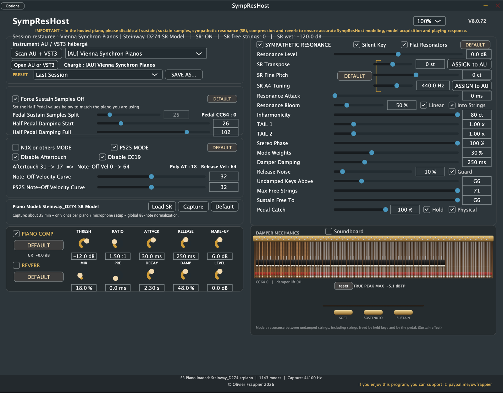

[README.md](https://github.com/user-attachments/files/32627676/README.md)
[README.md](https://github.com/user-attachments/files/32625575/README.md)
<h1 align="center">SympResHost</h1>
<p align="center"><b>Bring your VST / AU piano to life — and to realism.</b></p>

<p align="center">
  SympResHost</h1>
<p align="center"><b>Bring your VST / AU piano to life — and to realism.</b></p>

<p align="center"><h1 align="center">SympResHost</h1>
<p align="center"><b>Bring your VST / AU piano to life — and to realism.</b></p>

<p align="center">
  
</p>

<p align="center">
  <a href="../../releases/latest"><b>⬇ Download the latest release</b></a> ·
  macOS 14+ · Apple Silicon · AU · VST3 · Standalone
</p>

---

## What it does

Most virtual pianos sound beautiful note by note, yet something is missing as soon as you
really *play*: the halo of strings ringing in sympathy, the bloom of the sustain pedal, the
way a chord changes colour as the dampers lift, the subtle breath of half-pedalling.
Built-in "sympathetic resonance" and "sustain resonance" options are often static,
generic, or simply absent.

**SympResHost** hosts your favourite piano plug-in and adds a physically modelled
**sympathetic resonance and sustain engine** around it.

### Driven by the real sound of your piano

SympResHost does not add a generic reverb or a canned resonance sample. The free strings
are set into vibration by **the actual audio of the piano you play**: every note, every
velocity, every nuance of the samples feeds the resonating strings in real time, exactly
as the soundboard of a real piano carries the vibration of one string to the others.

### Calibrated for each piano

Each piano can be **calibrated precisely** with the built-in **automatic capture**:
SympResHost plays the **88 notes pedal up**, one by one, analyses the real partials,
their tuning, their inharmonicity and their decay times, and builds a resonance model
unique to that instrument (about 35 minutes, done once). A model of the VSL Synchron
Steinway D-274 is included and ready to use.

### Features

- **Every string can resonate.** The resonance comes from a model of the real partials of
  each string, measured from the piano you host. A held key frees its string; the pedal
  frees them all — exactly like the dampers of a real grand.
- **Real half-pedalling.** Resonance and damping follow the pedal continuously, from the
  first touch of the dampers to full sustain. Pedal-up / pedal-down transitions, chords
  caught in the pedal, syncopated pedalling and sostenuto behave naturally.
- **Pedal catch.** Press the pedal just *after* the notes and the strings still sounding
  feed the freed strings — gently, as on a real instrument.
- **Natural string release.** When a damper falls, the partials of the string die away
  progressively instead of being cut.
- **Honest colour.** Measured inharmonicity, per-string decay times, the colour of strings
  driven through the bridge (not by the hammer), and an optional microphone-pair stereo
  image.
- **Damper mechanics view.** A live, realistic view of the dampers and strings, at no
  CPU cost.

## Why sustain is not a separate effect

Many virtual pianos offer "sustain resonance" and "sympathetic resonance" as two separate
effects. On a real grand piano they are **one and the same phenomenon**. The sustain
pedal does nothing more than lift every damper at once:

| What you do | What happens inside the piano |
|---|---|
| One key held | One string is free to vibrate |
| A chord held | A few strings are free |
| Pedal down | **Every** string is free |
| Half pedal | Every string is free, but still lightly touched by the dampers |

One physical mechanism, simply more or fewer free strings, more or less damping.
SympResHost models exactly that, with a single engine. That is why pedal-up / pedal-down
transitions, half-pedalling, chords caught in the pedal and a single held note all sound
natural: there is no switching or cross-fading between two effects, only the same strings
being freed or damped.

### The release, too

When a key is released or the pedal comes up, the dampers do not cut the sound like a
switch. The felt lands on the vibrating string and damps it progressively, some partials
dying faster than others depending on where the damper touches the string.
SympResHost **re-creates this release**: the string's own partials, taken from the real
sound of your piano, die away gently as the damper settles, with a lighter or firmer touch
depending on how you release the key or the pedal. With half-pedalling, the dampers resting
lightly on the strings keep damping them softly instead of stopping them.

### Your release gesture counts

How fast you let a key come up changes how the damper lands, so SympResHost listens to it:

- **Note-off (release) velocity** from any keyboard that sends it: a slow release gives a
  softer, longer damping; a quick one stops the string more firmly. An adjustable curve
  lets you match your keyboard.
- **Yamaha N1X and similar Yamaha hybrids**: these instruments report the key release
  through polyphonic aftertouch. **N1X mode** turns it into release velocity, and can
  filter the aftertouch and CC19 messages so the hosted piano does not receive them.
- **Yamaha P-525**: **P525 mode** measures the timing of the release information the
  P-525 sends and turns it into release velocity, with its own curve.
- The speed at which you **lift your foot off the pedal** shapes the damping of all the
  strings in the same way.

## Requirements

| | |
|---|---|
| **Mac** | Apple Silicon (M2 or later recommended). Intel Macs are not supported. |
| **macOS** | 14 Sonoma or later |
| **Formats** | Audio Unit, VST3, Standalone application |
| **Hosted piano** | Any AU or VST3 piano plug-in built for Apple Silicon |

The plug-in does not load in a host running under Rosetta.

## Installation

1. Download `SympResHost-<version>-macOS-AppleSilicon.pkg` from
   [Releases](../../releases/latest).
2. Double-click it. The installer is signed and notarized by Apple: no security warning.
3. Choose what to install: Audio Unit, VST3 and/or the standalone application.
4. In your DAW, insert **SympResHost** as an instrument, then load your piano inside it
   with **Scan AU + VST3** / **Open AU or VST3**.

Optional integrity check:
```
shasum -a 256 SympResHost-<version>-macOS-AppleSilicon.pkg
```
and compare with the `.sha256` file of the release.

## Setting up your piano (important)

SympResHost provides the resonance and the sustain behaviour itself. To avoid doubling
them, **in the hosted piano**:

- **turn off** every *sympathetic resonance*, *sustain resonance*, *pedal resonance* or
  *sustain samples* option;
- **keep** the *half-pedal* and *pedal catch* related options if your piano has them;
- also turn off the piano's own compression and reverb (SympResHost has its own, optional).

### Tested pianos

| Piano | Status | Notes |
|---|---|---|
| **VSL Synchron Steinway D-274** | Reference | Default settings are tuned on it. Enable **Force Sustain Samples Off** in SympResHost so VSL does not play its own sustain samples. |
| **Ivory 3** (Synthogy) | Works very well | In the Ivory preset, turn off *Sustain* and *Sympathetic Resonance*. To our ears the resonance and sustain even sound better than Ivory's built-in ones — a subjective opinion, not a promise. |
| **Kontakt pianos** | Should work | Turn off the sustain / sympathetic resonance options of the instrument. |
| **VSL Synchron CFX / Imperial** | Possibly incompatible | Not tested yet — feedback welcome. |

Other VSL pianos: try **Force Sustain Samples Off** if the pedal still triggers the
library's sustain samples.

## Enjoying SympResHost?

SympResHost is free, and it took months of listening, measuring and comparing with real
pianos. If it has given your piano a new life, you can say thank you — the price of a
couple of coffees, **10 € or 20 €**, keeps the project moving:

<p align="center">
  <a href="https://www.paypal.com/paypalme/owfrappier"><b>♥ Support SympResHost on PayPal</b></a>
</p>

Every contribution, however small, is read, appreciated and turned into new versions.

## Feedback

Found a piano that works (or doesn't)? Please open an
[issue](../../issues) with the piano name, its version and your SympResHost settings.

## About

SympResHost is developed by **Olivier Frappier**, pianist.
The code was designed and written with the help of **Claude** (Anthropic) and other AI
assistants, guided by many hours of listening tests and comparisons with real pianos.
Built with the JUCE framework.

The source code is not public; this repository hosts the official releases only.

---

<sub>
© 2026 Olivier Frappier. All rights reserved.<br>
Steinway, Vienna Symphonic Library / VSL, Synchron, Ivory / Synthogy, Kontakt / Native
Instruments, Yamaha CFX and Bösendorfer Imperial are trademarks of their respective owners.
SympResHost is an independent product and is not affiliated with, endorsed by or
sponsored by any of them. "Steinway D-274" designates the sampled instrument used for the
built-in resonance model.<br>
VST is a registered trademark of Steinberg Media Technologies GmbH.
Audio Unit and macOS are trademarks of Apple Inc.
</sub>

  
</p>

<p align="center">
  <a href="../../releases/latest"><b>⬇ Download the latest release</b></a> ·
  macOS 14+ · Apple Silicon · AU · VST3 · Standalone
</p>

---

## What it does

Most virtual pianos sound beautiful note by note, yet something is missing as soon as you
really *play*: the halo of strings ringing in sympathy, the bloom of the sustain pedal, the
way a chord changes colour as the dampers lift, the subtle breath of half-pedalling.
Built-in "sympathetic resonance" and "sustain resonance" options are often static,
generic, or simply absent.

**SympResHost** hosts your favourite piano plug-in and adds a physically modelled
**sympathetic resonance and sustain engine** around it.

### Driven by the real sound of your piano

SympResHost does not add a generic reverb or a canned resonance sample. The free strings
are set into vibration by **the actual audio of the piano you play**: every note, every
velocity, every nuance of the samples feeds the resonating strings in real time, exactly
as the soundboard of a real piano carries the vibration of one string to the others.

### Calibrated for each piano

Each piano can be **calibrated precisely** with the built-in **automatic capture**:
SympResHost plays the **88 notes pedal up**, one by one, analyses the real partials,
their tuning, their inharmonicity and their decay times, and builds a resonance model
unique to that instrument (about 35 minutes, done once). A model of the VSL Synchron
Steinway D-274 is included and ready to use.

### Features

- **Every string can resonate.** The resonance comes from a model of the real partials of
  each string, measured from the piano you host. A held key frees its string; the pedal
  frees them all — exactly like the dampers of a real grand.
- **Real half-pedalling.** Resonance and damping follow the pedal continuously, from the
  first touch of the dampers to full sustain. Pedal-up / pedal-down transitions, chords
  caught in the pedal, syncopated pedalling and sostenuto behave naturally.
- **Pedal catch.** Press the pedal just *after* the notes and the strings still sounding
  feed the freed strings — gently, as on a real instrument.
- **Natural string release.** When a damper falls, the partials of the string die away
  progressively instead of being cut.
- **Honest colour.** Measured inharmonicity, per-string decay times, the colour of strings
  driven through the bridge (not by the hammer), and an optional microphone-pair stereo
  image.
- **Damper mechanics view.** A live, realistic view of the dampers and strings, at no
  CPU cost.

## Requirements

| | |
|---|---|
| **Mac** | Apple Silicon (M2 or later recommended). Intel Macs are not supported. |
| **macOS** | 14 Sonoma or later |
| **Formats** | Audio Unit, VST3, Standalone application |
| **Hosted piano** | Any AU or VST3 piano plug-in built for Apple Silicon |

The plug-in does not load in a host running under Rosetta.

## Installation

1. Download `SympResHost-<version>-macOS-AppleSilicon.pkg` from
   [Releases](../../releases/latest).
2. Double-click it. The installer is signed and notarized by Apple: no security warning.
3. Choose what to install: Audio Unit, VST3 and/or the standalone application.
4. In your DAW, insert **SympResHost** as an instrument, then load your piano inside it
   with **Scan AU + VST3** / **Open AU or VST3**.

Optional integrity check:
```
shasum -a 256 SympResHost-<version>-macOS-AppleSilicon.pkg
```
and compare with the `.sha256` file of the release.

## Setting up your piano (important)

SympResHost provides the resonance and the sustain behaviour itself. To avoid doubling
them, **in the hosted piano**:

- **turn off** every *sympathetic resonance*, *sustain resonance*, *pedal resonance* or
  *sustain samples* option;
- **keep** the *half-pedal* and *pedal catch* related options if your piano has them;
- also turn off the piano's own compression and reverb (SympResHost has its own, optional).

### Tested pianos

| Piano | Status | Notes |
|---|---|---|
| **VSL Synchron Steinway D-274** | Reference | Default settings are tuned on it. Enable **Force Sustain Samples Off** in SympResHost so VSL does not play its own sustain samples. |
| **Ivory 3** (Synthogy) | Works very well | In the Ivory preset, turn off *Sustain* and *Sympathetic Resonance*. To our ears the resonance and sustain even sound better than Ivory's built-in ones — a subjective opinion, not a promise. |
| **Kontakt pianos** | Should work | Turn off the sustain / sympathetic resonance options of the instrument. |
| **VSL Synchron CFX / Imperial** | Possibly incompatible | Not tested yet — feedback welcome. |

Other VSL pianos: try **Force Sustain Samples Off** if the pedal still triggers the
library's sustain samples.

## Enjoying SympResHost?

SympResHost is free, and it took months of listening, measuring and comparing with real
pianos. If it has given your piano a new life, you can say thank you — the price of a
couple of coffees, **10 € or 20 €**, keeps the project moving:

<p align="center">
  <a href="https://www.paypal.com/paypalme/owfrappier"><b>♥ Support SympResHost on PayPal</b></a>
</p>

Every contribution, however small, is read, appreciated and turned into new versions.

## Feedback

Found a piano that works (or doesn't)? Please open an
[issue](../../issues) with the piano name, its version and your SympResHost settings.

## About

SympResHost is developed by **Olivier Frappier**, pianist.
The code was designed and written with the help of **Claude** (Anthropic) and other AI
assistants, guided by many hours of listening tests and comparisons with real pianos.
Built with the JUCE framework.

The source code is not public; this repository hosts the official releases only.

---

<sub>
© 2026 Olivier Frappier. All rights reserved.<br>
Steinway, Vienna Symphonic Library / VSL, Synchron, Ivory / Synthogy, Kontakt / Native
Instruments, Yamaha CFX and Bösendorfer Imperial are trademarks of their respective owners.
SympResHost is an independent product and is not affiliated with, endorsed by or
sponsored by any of them. "Steinway D-274" designates the sampled instrument used for the
built-in resonance model.<br>
VST is a registered trademark of Steinberg Media Technologies GmbH.
Audio Unit and macOS are trademarks of Apple Inc.
</sub>
idth="900">
</p>

<p align="center">
  <a href="../../releases/latest"><b>⬇ Download the latest release</b></a> ·
  macOS 14+ · Apple Silicon · AU · VST3 · Standalone
</p>

---

## What it does

Most virtual pianos sound beautiful note by note, yet something is missing as soon as you
really *play*: the halo of strings ringing in sympathy, the bloom of the sustain pedal, the
way a chord changes colour as the dampers lift, the subtle breath of half-pedalling.
Built-in "sympathetic resonance" and "sustain resonance" options are often static,
generic, or simply absent.

**SympResHost** hosts your favourite piano plug-in and adds a physically modelled
**sympathetic resonance and sustain engine** around it:

- **Every string can resonate.** The resonance comes from a model of the real partials of
  each string, measured from the piano you host. A held key frees its string; the pedal
  frees them all — exactly like the dampers of a real grand.
- **Real half-pedalling.** Resonance and damping follow the pedal continuously, from the
  first touch of the dampers to full sustain. Pedal-up / pedal-down transitions, chords
  caught in the pedal, syncopated pedalling and sostenuto behave naturally.
- **Pedal catch.** Press the pedal just *after* the notes and the strings still sounding
  feed the freed strings — gently, as on a real instrument.
- **Natural string release.** When a damper falls, the partials of the string die away
  progressively instead of being cut.
- **Honest colour.** Measured inharmonicity, per-string decay times, the colour of strings
  driven through the bridge (not by the hammer), and an optional microphone-pair stereo
  image.
- **Damper mechanics view.** A live, realistic view of the dampers and strings, at no
  CPU cost.
- **Capture your own piano.** Build a resonance model of any hosted piano in one pass
  (about 35 minutes), or use the built-in Steinway D-274 model.

## Requirements

| | |
|---|---|
| **Mac** | Apple Silicon (M2 or later recommended). Intel Macs are not supported. |
| **macOS** | 14 Sonoma or later |
| **Formats** | Audio Unit, VST3, Standalone application |
| **Hosted piano** | Any AU or VST3 piano plug-in built for Apple Silicon |

The plug-in does not load in a host running under Rosetta.

## Installation

1. Download `SympResHost-<version>-macOS-AppleSilicon.pkg` from
   [Releases](../../releases/latest).
2. Double-click it. The installer is signed and notarized by Apple: no security warning.
3. Choose what to install: Audio Unit, VST3 and/or the standalone application.
4. In your DAW, insert **SympResHost** as an instrument, then load your piano inside it
   with **Scan AU + VST3** / **Open AU or VST3**.

Optional integrity check:
```
shasum -a 256 SympResHost-<version>-macOS-AppleSilicon.pkg
```
and compare with the `.sha256` file of the release.

## Setting up your piano (important)

SympResHost provides the resonance and the sustain behaviour itself. To avoid doubling
them, **in the hosted piano**:

- **turn off** every *sympathetic resonance*, *sustain resonance*, *pedal resonance* or
  *sustain samples* option;
- **keep** the *half-pedal* and *pedal catch* related options if your piano has them;
- also turn off the piano's own compression and reverb (SympResHost has its own, optional).

### Tested pianos

| Piano | Status | Notes |
|---|---|---|
| **VSL Synchron Steinway D-274** | Reference | Default settings are tuned on it. Enable **Force Sustain Samples Off** in SympResHost so VSL does not play its own sustain samples. |
| **Ivory 3** (Synthogy) | Works very well | In the Ivory preset, turn off *Sustain* and *Sympathetic Resonance*. To our ears the resonance and sustain even sound better than Ivory's built-in ones — a subjective opinion, not a promise. |
| **Kontakt pianos** | Should work | Turn off the sustain / sympathetic resonance options of the instrument. |
| **VSL Synchron CFX / Imperial** | Possibly incompatible | Not tested yet — feedback welcome. |

Other VSL pianos: try **Force Sustain Samples Off** if the pedal still triggers the
library's sustain samples.

## Enjoying SympResHost?

SympResHost is free, and it took months of listening, measuring and comparing with real
pianos. If it has given your piano a new life, you can say thank you — the price of a
couple of coffees, **10 € or 20 €**, keeps the project moving:

<p align="center">
  <a href="https://www.paypal.com/paypalme/owfrappier"><b>♥ Support SympResHost on PayPal</b></a>
</p>

Every contribution, however small, is read, appreciated and turned into new versions.

## Feedback

Found a piano that works (or doesn't)? Please open an
[issue](../../issues) with the piano name, its version and your SympResHost settings.

## About

SympResHost is developed by **Olivier Frappier**, pianist.
The code was designed and written with the help of **Claude** (Anthropic) and other AI
assistants, guided by many hours of listening tests and comparisons with real pianos.
Built with the JUCE framework.

The source code is not public; this repository hosts the official releases only.

---

<sub>
© 2026 Olivier Frappier. All rights reserved.<br>
Steinway, Vienna Symphonic Library / VSL, Synchron, Ivory / Synthogy, Kontakt / Native
Instruments, Yamaha CFX and Bösendorfer Imperial are trademarks of their respective owners.
SympResHost is an independent product and is not affiliated with, endorsed by or
sponsored by any of them. "Steinway D-274" designates the sampled instrument used for the
built-in resonance model.<br>
VST is a registered trademark of Steinberg Media Technologies GmbH.
Audio Unit and macOS are trademarks of Apple Inc.
</sub>
